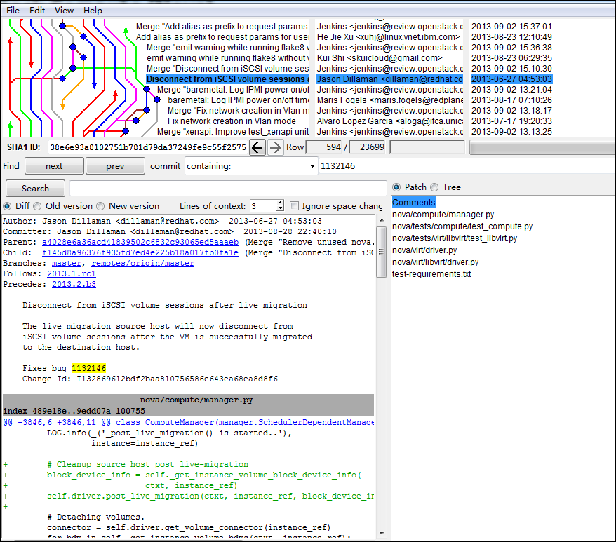
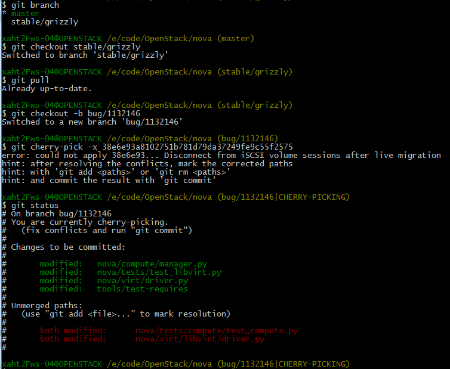
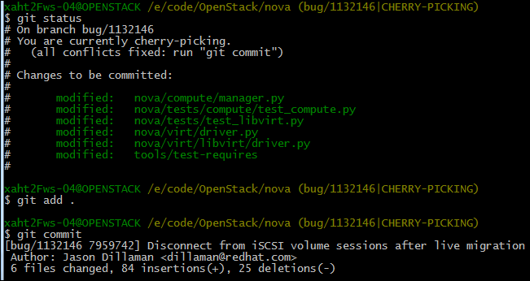
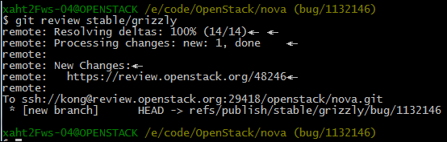
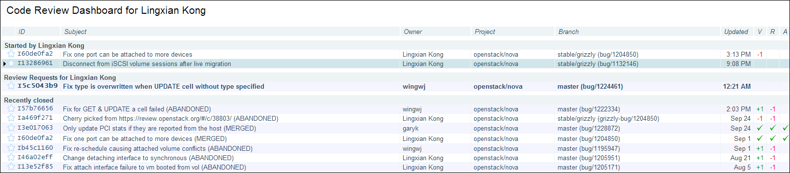
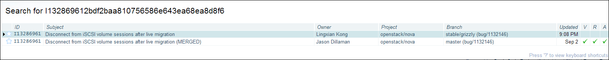

## how to back-port bugs from master to stable/grizzly

- 查找tag为[grizzly-backport-potential](https://bugs.launchpad.net/nova/+bugs?field.tag=grizzly-backport-potential)的bug，挑选那些尽量是对功能有影响的bug，以bug1132146为例  
- 查看该bug在master分支修改的文件，代码尽量相对独立，这样反合后的conflict较少  
  
- 记录bugfix的commit的SHA1，38e6e93a8102751b781d79da37249fe9c55f2575  
- 打开git，进入nova代码目录，进行如下操作：  
  
- 发现有冲突，手动解决冲突后，进行如下操作：  
  
*记得将message里面的change-id放置到最后一行*。  
- 提交之后，就可以进行git review操作：  
  
- 此时，可以登录gerrit，看到新提交的review申请，点击review的change-id，会看到同一个change-id对应两个提交：  
  
